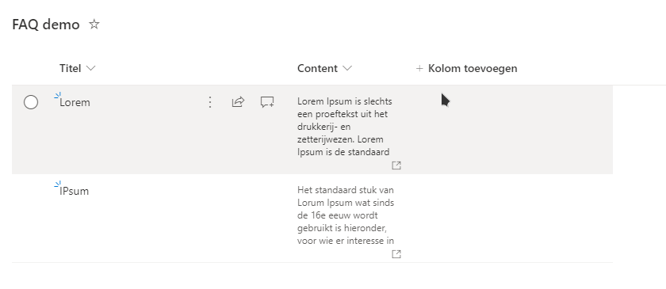
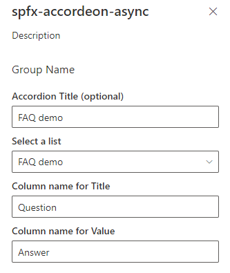
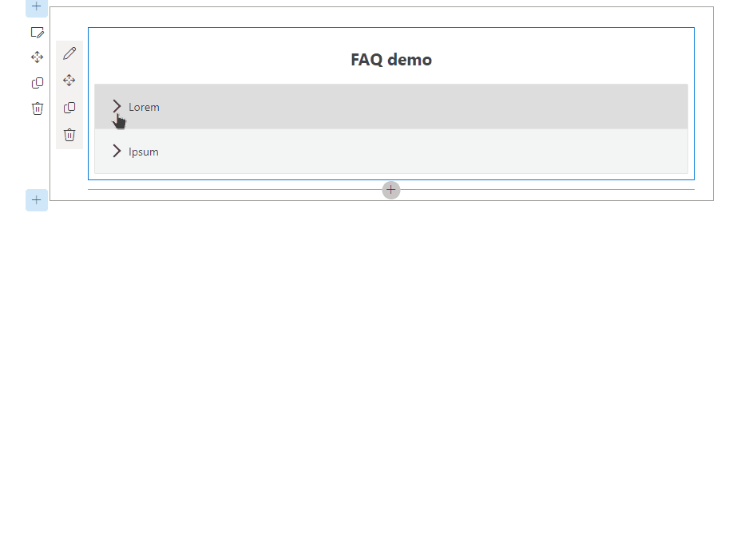

# Async-sp-accordeon

This project uses [React](https://reactjs.org).

## SPFx Accordion Section FAQ Builder web part

* Adds a collapsible accordion section to an Office 365 SharePoint page or Teams Tab.
* Ideal for creating FAQs.
* When adding the web part, you'll be prompted to select a list from a property panel dropdown (target list must have a Title column and Content column).  This will generate an accordion with one section for each item in the list.
* Modifications/deletions/additions to the list items in the target list of an added web part are automatically reflected on the page.
* To deploy to a Teams tab see current [Microsoft documentation](https://docs.microsoft.com/en-us/sharepoint/dev/spfx/web-parts/get-started/using-web-part-as-ms-teams-tab).

## Usage

**1a) Create or use a list with a Title and a Content column:**
* The value in the Title column for each item will appear in the heading bars of the Accordion.  
* The value in the Content column for each item will appear in the collapsible content section of the Accordion
* When creating the columns, select "Multiple lines of text".  Rich text is now supported within the Content column.



**1b) Use an existing list with Text columns:**
* The value in the titlefield column for each item will appear in the heading bars of the Accordion.  
* The value in the valuefield column for each item will appear in the collapsible content section of the Accordion




**2) Add the Accordion Section web part to your page & select your list:**  



## SharePoint Framework Version 
1.8.2

## Applies to

* [SharePoint Framework](https:/dev.office.com/sharepoint)
* [Office 365 tenant](https://dev.office.com/sharepoint/docs/spfx/set-up-your-development-environment)

## Global dependencies

Requires Gulp globally installed:

```shell
npm install --global gulp
```

## Building the code

Download & install all dependencies, build, bundle & package the project

```shell
# download & install dependencies
npm install

# transpile all TypeScript & SCSS => JavaScript & CSS
gulp build

# create component bundle & manifest
gulp bundle

# create SharePoint package
gulp package-solution
```

These commands produce the following:

- **./lib**: intermediate-stage commonjs build artifacts
- **./dist**: bundled script, along with other resources
- **./temp/deploy**: all resources required by component(s) to deploy to a CDN (when `--ship` argument present)

## Build options

- `gulp clean`: Deletes all build output (**/dist**, **/lib**, **/temp**, etc.).
- `gulp build`: Transpiles all TypeScript & SCSS to JavaScript & CSS, generates source map files & TypeScript type declaration files
- `gulp bundle [--ship|-p|--production]`: Runs gulp task **build**, then uses webpack to create the JavaScript bundle(s) and component manifest(s) as defined in **./config/config.json**. The `--ship`, `-p` or `--production` argument specifies a production build that will generate minified bundles.
- `gulp serve [--ship|-p|--production]`: Runs gulp tasks **build**, **bundle** & starts the local webserver. Depending on the project type, it opens the browser and navigates to the local workbench or specified URL (in the case of extension components). The `--ship`, `-p` or `--production` argument specifies a production build that modifies the resulting package for production hosting rather than local hosting of assets.
- `gulp package-solution`: Creates the SharePoint Package (**.sppkg**) file.
- `gulp dist`: Creates a production-ready SharePoint Package (**.sppkg**) file. The following gulp task gets executed in this specific order `gulp clean`, `gulp bundle`, `gulp package-solution.`
- `gulp dev`: Creates a development-ready SharePoint Package (**.sppkg**) file. The following gulp task will be executed in this specific order `gulp clean`, `gulp bundle`, `gulp package-solution.`

> View all available gulp tasks by running `gulp --tasks`

More information on [SharePoint Framework](https://docs.microsoft.com/en-us/sharepoint/dev/spfx/sharepoint-framework-overview)

Generated with [pnp/spfx](https://github.com/pnp/generator-spfx/).

### Testing and Deployment

- Clone or download this repository
- Run in command line:
  - `npm install` to install the npm dependencies
- To test:
  - `gulp serve --nobrowser`
  -  Test within a site in your tenant using the Remote Workbench by navigating to *https://\{yourtenant\}.sharepoint.com/sites/\{yoursite\}/_layouts/15/workbench.aspx*.  Use Lists within your site that follow the **Usage** guidelines above.  Local workbench testing not supported
- To package and deploy:
  - Use `gulp bundle --ship` & `gulp package-solution --ship`
  - Add the .sppkg to your SharePoint App Catalog

  nvm version 14.7.5